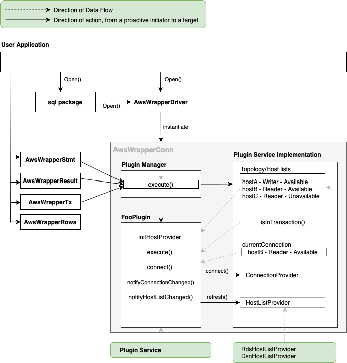

# Architecture

The AWS Advanced Go Wrapper contains 5 main components:

1. The wrapper classes
2. The [plugin manager](./PluginManager.md)
3. The [loadable and extensible plugins](./LoadablePlugins.md)
4. The [plugin service](./PluginService.md)
5. The host list providers

The wrapper classes ensures all Go sql method calls are redirected to be handled by the plugin manager.

The plugin manager handles all the loaded or registered plugins and sends the method call to be executed by all plugins [**subscribed**](./LoadablePlugins.md#subscribed-methods) to that method.

During execution, plugins may utilize the plugin service to help its execution by retrieving or updating:

- the current connection
- the host's information or topology of the database

> [!NOTE]
>
> - Each AwsWrapperConn object has its own instances of:
>   - plugin manager
>   - plugin service
>   - loaded plugin classes
> - Multiple Go Conn objects opened to the same database server will have separate sets of instances mentioned above.
> - All plugins share the same instance of plugin service and the same instance of host list provider.
