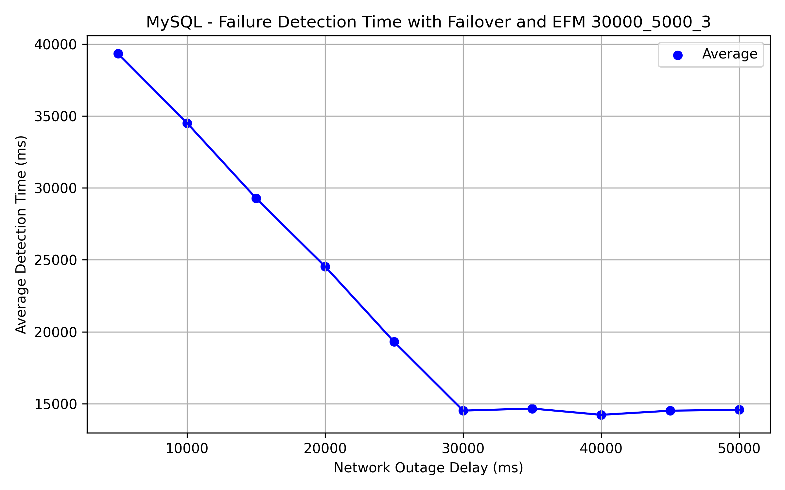

# Contributor Guide

### Setup

Clone the AWS Advanced Go Wrapper repository:

```bash
git clone https://github.com/aws/aws-advanced-go-wrapper.git
```

You can now make changes in the repository.

## Testing Overview

The AWS Advanced Go Wrapper uses the following tests to verify its correctness and performance:

| Tests                                         | Description                                                                                                           |
|-----------------------------------------------|-----------------------------------------------------------------------------------------------------------------------|
| Unit tests                                    | Tests for AWS Advanced Go Wrapper correctness.                                                                        |
| Failover integration tests                    | Wrapper-specific tests for different reader and writer failover workflows using the Failover Connection Plugin.       |
| Enhanced failure monitoring integration tests | Wrapper-specific tests for the enhanced failure monitoring functionality using the Host Monitoring Connection Plugin. |
| AWS authentication integration tests          | Wrapper-specific tests for AWS authentication methods with the AWS IAM Authentication Plugin.                         |
| Connection plugin manager benchmarks          | The benchmarks measure the overhead from executing method calls with multiple connection plugins enabled.             |

### Performance Tests

The AWS Advanced Go Wrapper has 2 types of performance tests:

1. manually-triggered performance tests measuring the failover and enhanced failure monitoring plugins' performance under different configurations.
2. benchmarks measuring the AWS Advanced Go Wrapper's overhead when executing simple methods using Go's built-in benchmarking framework.

#### AWS Advanced Go Wrapper Benchmarks

There are specific benchmarks measuring the AWS Advanced Go Wrapper's plugin pipeline performance. The goal of these benchmarks is to measure the overhead of using the AWS Advanced Go Wrapper with multiple plugins enabled. These benchmarks do not make actual connections to the databases, and they test connections with different numbers of simple test plugins. The images below represent the benchmarks for the `Connect`, `Execute`, and `ReleaseResources` operations.


##### [Connect Pipeline](../contributor-guide/Pipelines.md#connect-pipeline)


##### [Execute Pipeline](../contributor-guide/Pipelines.md#execute-pipeline)


##### [Release Resources Pipeline](../contributor-guide/Pipelines.md#release-resources-pipeline)


See [here](PluginPipelinePerformanceResults.md#plugin-benchmarks) for a detailed performance breakdown.

#### Failover-specific Performance Tests

The diagrams in this section show the AWS Advanced Go Wrapper's failure detection performance with or without the Failover Connection Plugin under different settings.
The performance tests share the following workflow:

1. The AWS Advanced Go Wrapper executes an SQL query with a long execution time.
2. After a network outage delay in milliseconds, the test triggers a network outage.
   Varying values for the network outage delay are tested, represented on the X axis of the diagrams below.
3. Measures elapsed time between when the network outage and
   - when the AWS Advanced Go Wrapper detects the network failure if the Host Monitoring Plugin is used, or
   - when the AWS Advanced Go Wrapper finishes the failover process if the Failover Plugin is used.

The following diagrams show how the AWS Advanced Go Wrapper performs under a more common failure detection setting versus a more aggressive setting.

Common Failure Detection Setting

| Parameter                  | Value    |
| -------------------------- | -------- |
| `failoverTimeoutMs`        | `120000` |
| `failureDetectionTime`     | `30000`  |
| `failureDetectionInterval` | `5000`   |
| `failureDetectionCount`    | `3`      |

Aggressive Failure Detection Setting

| Parameter                  | Value    |
| -------------------------- | -------- |
| `failoverTimeoutMs`        | `120000` |
| `failureDetectionTime`     | `6000`   |
| `failureDetectionInterval` | `1000`   |
| `failureDetectionCount`    | `1`      |

For more details on failure detection settings, see [here](../user-guide/using-plugins/UsingTheHostMonitoringPlugin.md#enhanced-failure-monitoring-parameters).
For more details on failover settings, see [here](../user-guide/FailoverConfigurationGuide.md).

#### Pgx Performance Results

The images below show the average failure detection time when failover and enhanced failure monitoring is enabled for Pgx.

This graph uses a 30000 millisecond `FailureDetectionGraceTime` and 5000 millisecond `NetworkOutageDelayMillis`:


This graph uses a 6000 millisecond `FailureDetectionGraceTime` and 1000 millisecond `NetworkOutageDelayMillis`:


The images below show the average failure detection time when enhanced failure monitoring is enabled for Pgx.

This graph uses a 30000 millisecond `FailureDetectionGraceTime` and 5000 millisecond `NetworkOutageDelayMillis`:


This graph uses a 6000 millisecond `FailureDetectionGraceTime` and 1000 millisecond `NetworkOutageDelayMillis`:


#### MySQL Performance Results

The images below show the average failure detection time when failover and enhanced failure monitoring is enabled for MySQL.

This graph uses a 30000 millisecond `FailureDetectionGraceTime` and 5000 millisecond `NetworkOutageDelayMillis`:


This graph uses a 6000 millisecond `FailureDetectionGraceTime` and 1000 millisecond `NetworkOutageDelayMillis`:


The images below show the average failure detection time when enhanced failure monitoring is enabled for MySQL.

This graph uses a 30000 millisecond `FailureDetectionGraceTime` and 5000 millisecond `NetworkOutageDelayMillis`:


This graph uses a 6000 millisecond `FailureDetectionGraceTime` and 1000 millisecond `NetworkOutageDelayMillis`:


See [here](PluginPipelinePerformanceResults.md#pgx-failover-performance-with-different-enhanced-failure-monitoring-configuration) for Pgx performance details and [here](PluginPipelinePerformanceResults.md#mysql-failover-performance-with-different-enhanced-failure-monitoring-configuration) for MySQL performance details.

### Running the Tests

Unit tests can be run from the `.test` module.

```bash
cd .test
go test ./test/...
```

#### Integration Tests

For more information on how to run the integration tests, please visit [Integration Tests](./IntegrationTests.md).

#### Sample Code

[Postgres Connection Test Sample Code](./../../examples/aws_simple_connection_postgresql_example.go)<br>
[MySQL Connection Test Sample Code](./../../examples/aws_simple_connection_mysql_example.go)

## Architecture

For more information on how the AWS Advanced Go Wrapper functions and how it is structured, please visit [Architecture](./Architecture.md).
