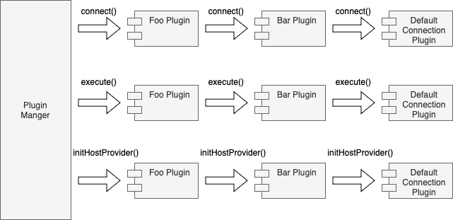

# Pipelines

A plugin pipeline is an execution workflow achieving a specific goal.

The plugin pipelines available in the driver are:
- The Connect pipeline.
- The ForceConnect pipeline
- The Execute pipeline.
- The HostListProvider pipeline.
- The NotifyConnectionChanged pipeline.
- The NotifyHostListChanged pipeline.
- The AcceptsStrategy pipeline.
- The GetHostInfoByStrategy pipeline.

A plugin does not need to implement all pipelines. A plugin can implement one or more pipelines depending on its functionality.

For information on how to subscribe to these pipelines, please see the documentation on [subscribed methods](./LoadablePlugins.md#subscribed-methods).

## Connect Pipeline

The connect pipeline performs any additional setup or post connection steps required to establish a Go connection. By default, the connect pipeline will establish connections using the `DriverConnectionProvider` class for connections requested through the `DriverManager`. If you would like to use your own provider to connect see [Connection Provider](../custom-config/ConnectionProvider.md) for details.

The most common usage of the connect pipeline is to fetch extra credentials from external locations.

An example would be the [IAM connection plugin](../user-guide/using-plugins/UsingTheIamAuthenticationPlugin.md). The IAM connection plugin generates an IAM authentication token to be used when establishing a connection. Since authentication is only required when establishing a Go connection and not required for any subsequent execution, the IAM authentication plugin only needs to implement the connect pipeline.

## Force Connect Pipeline

The force connect pipeline is similar to the connect pipeline except that it will use the default `DriverConnectionProvider` class to establish connections regardless of whether a non-default `ConnectionProvider` has been requested. For most plugins, the connect and force connect implementation will be equivalent.

## Execute Pipeline

The execute pipeline performs additional work for Go method calls. This pipeline is not limited to query execution methods, it may be called for any Go methods such as `Ping` or `IsValid`.

Usages for this pipeline include:

- handling execution exceptions
- logging and measuring execution information
- caching execution results

An example of the execute pipeline is the execution time connection plugin.
This plugin measures and logs the time required to execute a Go method.

A more complex example of this would be the [failover connection plugin](../user-guide/using-plugins/UsingTheFailoverPlugin.md).
The failover connection plugin performs two main tasks before and after the Go method call:

- updates the host lists before executing the Go sql method
- catches network exceptions and performs the failover procedure

## HostListProvider Pipeline

The host list provider pipeline sets up the [host list provider](./PluginService.md#host-list-providers) via the plugin service.
This pipeline is executed once during the initialization stage of the connection.

All subscribed plugins are called to set up their respective host list provider.
Since each connection may only have one host list provider,
setting a host list provider would override any previously set host list providers.

The host list providers are used to retrieve host information about the database server,
either from the connection string or by querying the database server.
For simple use cases where having up-to-date information on all existing database replicas is not necessary,
using a simple host list provider such as the [DSN host list provider](../../awssql/driver_infrastructure/dsn_host_list_provider.go) would be necessary.
The DSN host list provider simply parses the host and port information from the connection string during initialization,
it does not perform any additional work.

For cases where keeping updated information on existing and available replicas is necessary,
such as during the failover procedure, it is important to have a host list provider that can re-fetch information once in a while,
like the [RDS host list provider](../../awssql/driver_infrastructure/rds_host_list_provider.go).
The RDS host list provider should be automatically used by the wrapper when the application is connecting to Aurora databases.
However, you can ensure that the provider is used by specifying a topology-aware dialect, for more information, see [Database Dialects](../user-guide/DatabaseDialects.md).

## NotifyConnectionChanged Pipeline

Plugins can subscribe to this pipeline to perform special handling when the current connection has changed. Once 
subscribed, plugins should override the `NotifyConnectionChanged` method to implement any desired logic. This method 
will be called whenever the current connection changes. Plugins can also provide suggestions of what to do with the old 
connection by returning an
[OldConnectionSuggestedAction](../../awssql/driver_infrastructure/fixed_value_types.go). The possible values are `NO_OPINION`, `DISPOSE`, and `PRESERVE`.

## NotifyHostListChanged Pipeline

Plugins can subscribe to this pipeline to perform special handling when the current host list of databases has changed. 
Once subscribed, plugins should override the `NotifyHostListChanged` method to implement any desired logic. This method
will be called whenever changes in the current host list are detected.

## AcceptsStrategy Pipeline

Plugins should subscribe to this pipeline and the GetHostInfoByStrategy pipeline if they implement a host selection strategy via the `GetHostInfoByStrategy` method. In this case, plugins should override the `AcceptsStrategy` and `GetHostInfoByStrategy` methods to implement any desired logic. The `AcceptsStrategy` method should return true for each selection strategy that the plugin supports.

## GetHostInfoByStrategy pipeline

Plugins should subscribe to this pipeline and the AcceptsStrategy pipeline if they implement a host selection strategy. The `GetHostInfoByStrategy` method should implement the desired logic for selecting a host using any plugin-accepted strategies. Host selection via a "random" strategy is supported by default.

