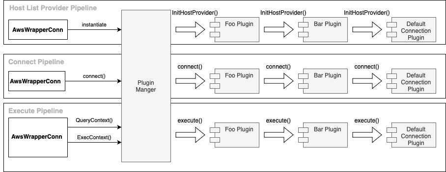

# Connection Plugin Manager

The connection plugin manager has the following main functionalities:

- Load and initialize plugins
- Initiate [pipelines](./Pipelines.md)

## Load and Initialize Plugins

The connection plugin manager initializes all plugins registered in the `plugins` parameter.

## Initiate Pipelines

During the initial connection phase, where the plugin manager gets initialized, it initiates the host list provider and the connect pipeline. These two pipelines will set up a host list provider to be used by all the plugins and the initial connection.

All subsequent Go methods calls will trigger the execute pipeline.

> [!NOTE]
> The execute pipeline does not limit to `execute` methods such as `ExecContext` or `Exec` or `Stmt` wrappers. All methods, such as `Conn.ResetSession` can trigger the execute pipeline. In other words, the execute pipeline is to execute all kinds of Go sql methods.
