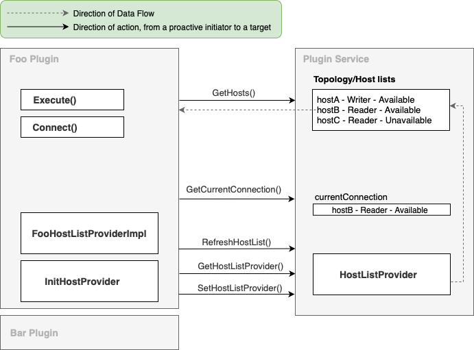

## Plugin Service

The plugin service retrieves and updates the current connection and its relevant host information.

It also keeps track of the host list provider in use, and notifies it to update its host list.

It is expected that the plugins do not establish a Go connection themselves, but rather call `PluginService.Connect()`
to establish connections.

## Host List Providers

The plugin service uses the host list provider to retrieve the most recent host information or topology information about the database.

The AWS Advanced Go Wrapper has two host list providers, the `DsnHostListProvider` and the `RdsHostListPovider`.

The `DsnHostListProvider` is the default provider, it parses the DSN for cluster information and stores the information. It supports having multiple hosts in the DSN with the same port:

| Host Parameter Value  | Port Parameter Value | Support            | Behaviour                                             |
|-----------------------|----------------------|--------------------|-------------------------------------------------------|
| `hostname1,hostname2` | nil                  | :white_check_mark: | Two hosts with the default port for the underlying DB |
| `hostname1,hostname2` | `8090`               | :white_check_mark: | Two hosts with port `8090`                            |
| `hostname1,hostname2` | `8030,8090`          | :x:                | DsnHostListProvider errors out during initialization  |

The `RdsHostListProvider` provides information of the Aurora cluster.
It uses the current connection to track the available hosts and their roles in the cluster.

The `DsnHostListProvider` is a static host list provider, whereas the `RdsHostListProvider` is a dynamic host list provider.
A static host list provider will fetch the host list during initialization and does not update the host list afterwards,
whereas a dynamic host list provider will update the host list information based on database status.
When implementing a custom host list provider, implement either the `StaticHostListProvider` or the `DynamicHostListProvider` marker interfaces to specify its provider type.
