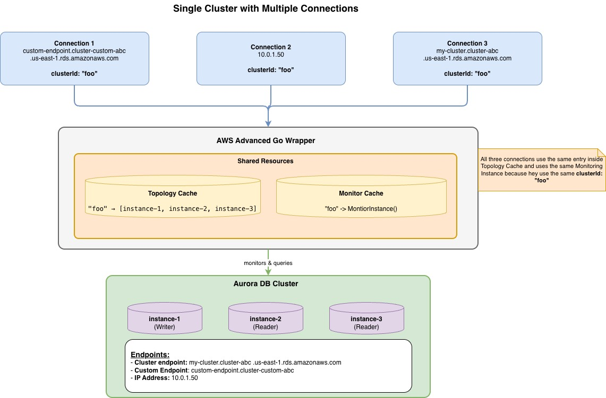
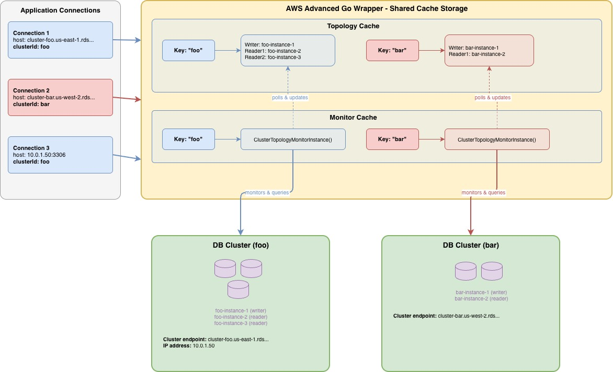

# Understanding the clusterId Parameter

## Overview

The `clusterId` parameter is a critical configuration setting when using the AWS Advanced Go Wrapper to **connect to multiple database clusters within a single application**. This parameter serves as a unique identifier that enables the wrapper to maintain separate caches and state for each distinct database cluster your application connects to.

## What is a Cluster?

Understanding what constitutes a cluster is crucial for correctly setting the `clusterId` parameter. In the context of the AWS Advanced Go Wrapper, a **cluster** is a logical grouping of database instances that should share the same topology cache and monitoring services.

A cluster represents one writer instance (primary) and zero or more reader instances (replicas). These make up shared topology that the wrapper needs to track, and are the group of instances the wrapper can reconnect to when a failover is detected.

### Examples of Clusters

- Aurora DB Cluster (one writer + multiple readers)
- RDS Multi-AZ DB Cluster (one writer + two readers)
- Aurora Global Database (when supplying a global db endpoint, the wrapper considers them as a single cluster)


> **Rule of thumb:** :thumbsup: If the wrapper should track separate topology information and perform independent failover operations, use different `clusterId` values. If instances share the same topology and failover domain, use the same `clusterId`.


## Why clusterId is Important

The AWS Advanced Go Wrapper uses the `clusterId` as a **key for internal caching mechanisms** to optimize performance and maintain cluster-specific state. Without proper `clusterId` configuration, your application may experience:

- Cache collisions between different clusters
- Incorrect topology information
- Degraded performance due to cache invalidation

## Why Not Use AWS DB Cluster Identifiers?

Host information can take many forms:

- **IP Address Connections:** `"host=10.0.1.50 port=3306 user=admin dbname=mydb password=***"` ← No cluster info!
- **Custom Domain Names:** `"host=db.mycompany.com port=3306 user=admin dbname=mydb password=***"` ← Custom domain
- **Custom Endpoints:** `"host=my-custom-endpoint.cluster-custom-abc.us-east-1.rds.amazonaws.com port=3306 user=admin dbname=mydb password=***"` ← Custom endpoint

In fact, all of these could reference the exact same cluster. Therefore, because the wrapper cannot reliably parse cluster information from all connection types, **it is up to the user to explicitly provide the `clusterId`**.

## How clusterId is Used Internally

The wrapper uses `clusterId` as a cache key for topology information and monitoring services. This enables multiple connections to the same cluster to share cached data and avoid redundant db meta-data.

### Example: Single Cluster with Multiple Connections

The following diagram shows how connections with the same `clusterId` share cached resources:



**Key Points:**
- Three connections use different connection strings (custom endpoint, IP address, cluster endpoint) but all specify **`clusterId: "foo"`**
- All three connections share the same Topology Cache and Monitor Threads in the wrapper
- The Topology Cache stores a key-value mapping where `"foo"` maps to `["instance-1", "instance-2", "instance-3"]`
- Despite different connection URLs, all connections monitor and query the same physical database cluster

**The Impact**
Shared resources eliminate redundant topology queries and reduce monitoring overhead.

### Example: Multiple Clusters with Separate Cache Isolation

The following diagram shows how different `clusterId` values maintain separate caches for different clusters.



**Key Points:**
- Connection 1 and 3 use **`clusterId: "foo"`** and share the same cache entries
- Connection 2 uses **`clusterId: "bar"`** and has completely separate cache entries
- Each `clusterId` acts as a key in the cache Map structure
- Topology Cache maintains separate entries: `"foo"` → `[instance-1, instance-2, instance-3]` and `"bar"` → `[instance-4, instance-5]`
- Monitor Cache maintains separate monitor threads for each cluster
- Monitors poll their respective database clusters and update the corresponding topology cache entries

**The Impact**
This isolation prevents cache collisions and ensures correct failover behavior for each cluster.

## When to Specify clusterId

### **Required: Multiple Clusters in One Application**

You **must** specify a unique `clusterId` for every DB cluster when your application connects to multiple database clusters:

```go
package main

import (
	"database/sql"
	"fmt"
	"log"

	_ "github.com/aws/aws-advanced-go-wrapper/mysql-driver"
)

func main() {
	// Source cluster connection
	sourceHost := "source-db.us-east-1.rds.amazonaws.com"
	sourceDsn := fmt.Sprintf("admin:***@tcp(%s:3306)/mydb?clusterId=source-cluster", sourceHost)
	sourceConn, err := sql.Open("awssql-mysql", sourceDsn)
	if err != nil {
		log.Fatal(err)
	}
	defer sourceConn.Close()

	// Destination cluster connection - different clusterId!
	destHost := "dest-db.us-west-2.rds.amazonaws.com"
	destDsn := fmt.Sprintf("admin:***@tcp(%s:3306)/mydb?clusterId=destination-cluster", destHost)
	destConn, err := sql.Open("awssql-mysql", destDsn)
	if err != nil {
		log.Fatal(err)
	}
	defer destConn.Close()

	// Read from source, write to destination
	rows, err := sourceConn.Query("SELECT id, name, email FROM users")
	if err != nil {
		log.Fatal(err)
	}
	defer rows.Close()

	// ... migration logic

	// If you are connecting source-db with a different url later on,
	// then you should use the same clusterId.
	sourceIpDsn := "admin:***@tcp(10.0.0.1:3306)/mydb?clusterId=source-cluster"
	sourceIpConn, err := sql.Open("awssql-mysql", sourceIpDsn)
	if err != nil {
		log.Fatal(err)
	}
	defer sourceIpConn.Close()
}
```

### **Optional: Single Cluster Applications**

If your application only connects to one cluster, you can omit `clusterId` (defaults to `"1"`):

```go
// Single cluster - clusterId defaults to "1"
db, err := sql.Open("awssql-mysql", "admin:***@tcp(my-cluster.us-east-1.rds.amazonaws.com:3306)/mydb")
```

This also includes if you have multiple connections using different host information:

```go
// clusterId defaults to "1" for both connections
urlDsn := "admin:***@tcp(my-cluster.us-east-1.rds.amazonaws.com:3306)/mydb"
urlConn, err := sql.Open("awssql-mysql", urlDsn)

// "10.0.0.1" -> ip address of my-cluster. So it is the same cluster.
ipDsn := "admin:***@tcp(10.0.0.1:3306)/mydb"
ipConn, err := sql.Open("awssql-mysql", ipDsn)
```

## Critical Warnings

### 🚨 **NEVER Share clusterId Between Different Clusters**

Using the same `clusterId` for different database clusters will cause serious issues:

```go
// ❌ WRONG - Same clusterId for different clusters
sourceDsn := "admin:***@tcp(source-db.us-east-1.rds.amazonaws.com:3306)/db?clusterId=shared-id"
destDsn := "admin:***@tcp(dest-db.us-west-2.rds.amazonaws.com:3306)/db?clusterId=shared-id" // BAD! Same ID for different cluster
```

**Problems this causes:**
- Topology cache collision (dest-db's topology could overwrite source-db's)
- Incorrect failover behavior (wrapper may try to failover to wrong cluster)
- Monitor conflicts (Only one monitor instance for both clusters will lead to undefined results)

**Correct approach:**
```go
// ✅ CORRECT - Unique clusterId for each cluster
sourceDsn := "admin:***@tcp(source-db.us-east-1.rds.amazonaws.com:3306)/db?clusterId=source-cluster"
destDsn := "admin:***@tcp(dest-db.us-west-2.rds.amazonaws.com:3306)/db?clusterId=destination-cluster"
```

### ⚠️ **Always Use Same clusterId for Same Cluster**

Using different `clusterId` values for the same cluster reduces efficiency:

```go
// ⚠️ SUBOPTIMAL - Different clusterIds for same cluster
sameClusterUrl := "my-cluster.us-east-1.rds.amazonaws.com"
dsn1 := fmt.Sprintf("admin:***@tcp(%s:3306)/db?clusterId=my-cluster-1", sameClusterUrl)
dsn2 := fmt.Sprintf("admin:***@tcp(%s:3306)/db?clusterId=my-cluster-2", sameClusterUrl) // Different ID for same cluster
```

**Problems this causes:**
- Duplication of caches
- Multiple monitoring threads for the same cluster

**Best practice:**
```go
// ✅ BEST - Same clusterId for same cluster
const clusterID = "my-cluster"
dsn1 := fmt.Sprintf("admin:***@tcp(%s:3306)/db?clusterId=%s", sameClusterUrl, clusterID)
dsn2 := fmt.Sprintf("admin:***@tcp(%s:3306)/db?clusterId=%s", sameClusterUrl, clusterID) // Shared cache and resources
```

## Summary

The `clusterId` parameter is essential for applications connecting to multiple database clusters. It serves as a cache key for topology information and monitoring services. Always use unique `clusterId` values for different clusters, and consistent values for the same cluster to maximize performance and avoid conflicts.
