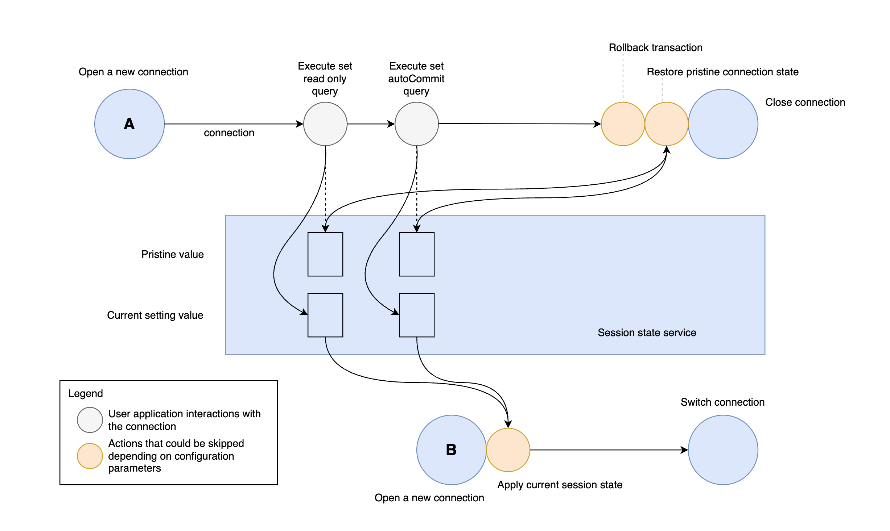

# Session States

## What is a Session State?

Every connection is associated with a connection session on the server and a group of related session settings like the autoCommit flag or the transaction isolation level. The following session settings are tracked by the AWS Advanced Go Wrapper, and together they form a session state:

- autoCommit
- readOnly
- transaction isolation level
- catalog
- schema

Since the AWS Advanced Go Wrapper can transparently switch physical connection to a server (for instance, during a cluster failover), it's important to re-apply a current session state to a new connection during such switch.

## Tracking Session States Changes

<div style="center"></div>

The diagram above shows the process of switching one database connection `A` to a new connection `B`. After connection `A` is established, it's returned to the user application. A user application may use this connection to query data from the database as well as to change some session settings. For example, if the user application executes a query that sets the session read only value to true on a connection, the AWS Advanced Go Wrapper intercepts this call and stores a new session setting for the `readOnly` setting. At the same time, the wrapper verifies if the original session setting is known or not. If the original setting is not known, the wrapper will make an additional `getReadOnly` call and store the result as a pristine value in order to save the original session setting. Later, the wrapper may need the pristine value to restore the connection session state to its original state.

## Restore to the Original Session State

Before closing connections of the [`driver.Conn`](https://pkg.go.dev/database/sql/driver#Conn) type, the AWS Advanced Go Wrapper may try to reset all changes to the session state made by the user application. If a pool of these connection objects is used, it may be necessary to clean up a session state before returning the connection to the pool to avoid side effects and errors when it is retrieved at a later time to be reused.

Before closing a connection, the AWS Advanced Go Wrapper sets its session state settings with the pristine values that have been previously stored in the driver. If a pristine value isn't available, it means that there have been no changes to that particular setting made by the user application, and that it's safe to assume that this setting is in its original/unchanged state.

Session state reset can be disabled by using `resetSessionStateOnClose` configuration parameter.

## Transfer Session State to a New Connection

When the driver needs to switch to a new connection, it opens a new connection and transfers a session state to it. All current session state values are applied to the new connection. Pristine values for a new connection are also fetched and stored if needed. When a new connection is configured, it replaces the current internal connection.

Session transfer can be disabled by using the `transferSessionStateOnSwitch` configuration parameter.

## Session State Custom Handlers

It's possible to extend or replace existing logic of resetting session state and transferring session state with custom handlers. Use the following methods to set and clear custom handlers:

- `SetResetSessionStateOnCloseFunc`
- `ClearResetSessionStateOnCloseFunc`
- `SetTransferSessionStateOnCloseFunc`
- `ClearTransferSessionStateOnCloseFunc`

```go
import "github.com/aws/aws-advanced-go-wrapper/awssql/driver_infrastructure"

func main() {
    // To set a custom transfer session state on close function:
    transferFunc := func (sessionState driver_infrastructure.SessionState, conn driver.Conn) bool {
        // Custom transfer session state
        return true
    }
    driver_infrastructure.SetTransferSessionStateOnCloseFunc(transferFunc)
    
    // To reset the transfer session state on close function:
    driver_infrastructure.ClearTransferSessionStateOnCloseFunc()
    
    // To set a reset transfer session state on close function:
        resetFunc := func (sessionState driver_infrastructure.SessionState, conn driver.Conn) bool {
        // Custom reset session state
    return true
    }
    driver_infrastructure.SetResetSessionStateOnCloseFunc(resetFunc)
    
    // To reset the reset session state on close function:
    driver_infrastructure.ClearResetSessionStateOnCloseFunc()
}
```
