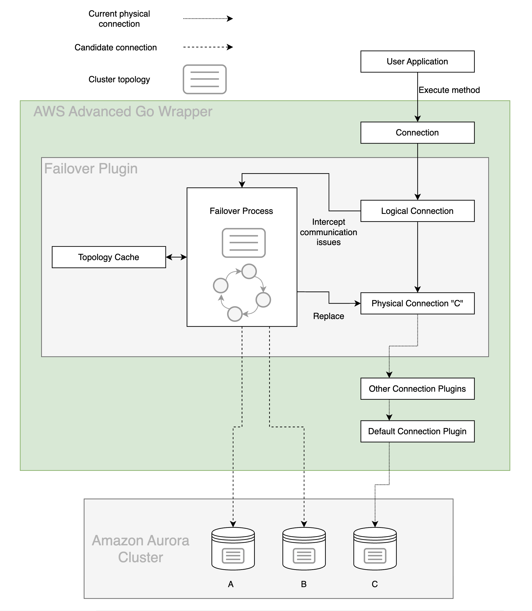

# Failover Plugin
In an Amazon Aurora database (DB) cluster, failover is a mechanism by which Aurora automatically repairs the DB cluster status when a primary DB instance becomes unavailable. It achieves this goal by electing an Aurora Replica to become the new primary DB instance, so that the DB cluster can provide maximum availability to a primary read-write DB instance. The AWS Advanced Go Wrapper uses the Failover Plugin to coordinate with this behavior in order to provide minimal downtime in the event of a DB instance failure.

## The AWS Advanced Go Wrapper Failover Process

The figure above provides a simplified overview of how the AWS Advanced Go Wrapper handles an Aurora failover encounter. Starting at the top of the diagram, an application gets a logical connection to an Aurora database.

In this example, the application requests a connection using the Aurora DB cluster endpoint and is returned with a logical connection that is physically connected to the primary DB instance in the DB cluster, DB instance C. By design, details about which specific DB instance the physical connection is connected to have been abstracted away.

Over the course of the application's lifetime, it executes various statements against the logical connection. If DB instance C is stable and active, these statements succeed and the application continues as normal. If DB instance C experiences a failure, Aurora will initiate failover to promote a new primary DB instance. At the same time, the Go Wrapper will intercept the related communication exception and kick off its own internal failover process.

If the primary DB instance has failed, the Go Wrapper attempts to use its internal topology cache to temporarily connect to an active Aurora Replica. This Aurora Replica will be periodically queried for the DB cluster topology until the new primary DB instance is identified (DB instance A or B in this case). If the wrapper is unable to connect to an active Aurora Replica or the cluster is still being reconfigured, the wrapper will retry the connection until it is successful.

At this point, the Go Wrapper will connect to the new primary DB instance and return control to the application by raising a FailoverSuccessError. Although the DNS endpoint for the DB cluster might not yet resolve the new primary DB instance, the Go Wrapper has already discovered this new DB instance during its failover process, and will be directly connected to it when the application continues executing statements. In this way the Go Wrapper provides a faster way to reconnect to a newly promoted DB instance, thus increasing the availability of the DB cluster.

> [!NOTE]
> When connecting using a database handle, the sql package may reconnect using the DSN even if failover is successful due to the pool automatically creating and freeing connections based on the DSN provided by the user. Failover results on `driver.Conn` objects will be more consistent.

## Using the Failover Plugin
The failover plugin will be enabled by default if the [`plugins`](../UsingTheGoWrapper.md#connection-plugin-manager-parameters) value is not specified. The failover plugin can also be explicitly included by adding the plugin code `failover` to the [`plugins`](../UsingTheGoWrapper.md#aws-advanced-go-wrapper-parameters) value. After you load the plugin, the failover feature will be enabled by default.     Please refer to the [failover configuration guide](../FailoverConfigurationGuide.md) for tips to keep in mind when using the failover plugin.

### Failover Parameters
In addition to the parameters that you can configure for the underlying driver, you can pass the following parameters to the AWS Advanced Go Wrapper through the connection URL to specify additional failover behavior.

In addition to the parameters that you can configure for the underlying driver, you can pass the following parameters to the AWS Advanced Go Wrapper through the connection URL to specify additional failover behavior.

| Parameter                            |  Value  |                                     Required                                     | Description                                                                                                                                                                                                                                                                                                                                                                                                                                                                                                                                                                                                                                                                                                                                                                                                                                                                                                                                                                                                              | Default Value                                                                                                                                                                                                   |
|--------------------------------------|:-------:|:--------------------------------------------------------------------------------:|:-------------------------------------------------------------------------------------------------------------------------------------------------------------------------------------------------------------------------------------------------------------------------------------------------------------------------------------------------------------------------------------------------------------------------------------------------------------------------------------------------------------------------------------------------------------------------------------------------------------------------------------------------------------------------------------------------------------------------------------------------------------------------------------------------------------------------------------------------------------------------------------------------------------------------------------------------------------------------------------------------------------------------|-----------------------------------------------------------------------------------------------------------------------------------------------------------------------------------------------------------------|
| `failoverMode`                       | String  |                                        No                                        | Defines a mode for failover process. Failover process may prioritize hosts with different roles and connect to them. Possible values:   - `strict-writer` - Failover process follows writer node and connects to a new writer when it changes. - `reader-or-writer` - During failover, the wrapper tries to connect to any available/accessible reader host. If no reader is available, the wrapper will connect to a writer node. This logic mimics the logic of the Aurora read-only cluster endpoint. - `strict-reader` - During failover, the wrapper tries to connect to any available reader host. If no reader is available, the wrapper raises an error. Reader failover to a writer host will only be allowed for single-node clusters. This logic mimics the logic of the Aurora read-only cluster endpoint.  If this parameter is omitted, default value depends on connection url. For Aurora read-only cluster endpoint, it's set to `reader-or-writer`. Otherwise, it's `strict-writer`. | Default value depends on connection url. For Aurora read-only cluster endpoint, it's set to `reader-or-writer`. Otherwise, it's `strict-writer`.                                                                |
| `clusterInstanceHostPattern`         | String  | If connecting using an IP address or custom domain URL: Yes  Otherwise: No | This parameter is not required unless connecting to an AWS RDS cluster via an IP address or custom domain URL. In those cases, this parameter specifies the cluster instance DNS pattern that will be used to build a complete instance endpoint. A "?" character in this pattern should be used as a placeholder for the DB instance identifiers of the instances in the cluster. See [here](#host-pattern) for more information.   Example: `?.my-domain.com`, `any-subdomain.?.my-domain.com:9999`  Use case Example: If your cluster instance endpoints follow this pattern:`instanceIdentifier1.customHost`, `instanceIdentifier2.customHost`, etc. and you want your initial connection to be to `customHost:1234`, then your connection string should look like this: `"host=host user=user dbname=database password=password clusterInstanceHostPattern=?.customHost"`                                                                                                                           | If the provided connection string is not an IP address or custom domain, the AWS Advanced Go Wrapper will automatically acquire the cluster instance host pattern from the customer-provided connection string. |
| `failoverTimeoutMs`                  | Integer |                                        No                                        | Maximum allowed time in milliseconds to attempt reconnecting to a new writer or reader instance after a cluster failover is initiated.                                                                                                                                                                                                                                                                                                                                                                                                                                                                                                                                                                                                                                                                                                                                                                                                                                                                                   | `300000`                                                                                                                                                                                                        |
| `failoverReaderHostSelectorStrategy` | String  |                                        No                                        | Strategy used to select a reader node during failover. For more information on the available reader selection strategies, see this [table](../ReaderSelectionStrategies.md).                                                                                                                                                                                                                                                                                                                                                                                                                                                                                                                                                                                                                                                                                                                                                                                                                                             | `random`                                                                                                                                                                                                        |
| `enableConnectFailover`              | Boolean |                                        No                                        | Enables/disables cluster-aware failover if the initial connection to the database fails due to a network exception. Note that this may result in a connection to a different instance in the cluster than was specified by the URL.                                                                                                                                                                                                                                                                                                                                                                                                                                                                                                                                                                                                                                                                                                                                                                                      | `false`                                                                                                                                                                                                         |
| `clusterTopologyRefreshRateMs`       | Number  |                                        No                                        | Cluster topology refresh rate in milliseconds when a cluster is not in failover.                                                                                                                                                                                                                                                                                                                                                                                                                                                                                                                                                                                                                                                                                                                                                                                                                                                                                                                                         | `30000`                                                                                                                                                                                                         |
| `clusterTopologyHighRefreshRateMs`   | Integer |                                        No                                        | Interval of time in milliseconds to wait between attempts to update cluster topology after the writer has come back online following a failover event. It corresponds to the increased monitoring rate described earlier. Usually, the topology monitoring component uses this increased monitoring rate for 30s after a new writer was detected.                                                                                                                                                                                                                                                                                                                                                                                                                                                                                                                                                                                                                                                                        | `100`                                                                                                                                                                                                           |

## Host Pattern
When connecting to Aurora clusters, the [`clusterInstanceHostPattern`](#failover-parameters) parameter is required if the connection string does not provide enough information about the database cluster domain name. If the Aurora cluster endpoint is used directly, the AWS Advanced Go Wrapper will recognize the standard Aurora domain name and can re-build a proper Aurora instance name when needed. In cases where the connection string uses an IP address, a custom domain name, or localhost, the driver won't know how to build a proper domain name for a database instance endpoint. For example, if a custom domain was being used to connect to a PostgreSQL database and the cluster instance endpoints followed a pattern of `instanceIdentifier1.customHost`, `instanceIdentifier2.customHost`, etc., the driver would need to know how to construct the instance endpoints using the specified custom domain. Since there isn't enough information from the custom domain alone to create the instance endpoints, you should set the `clusterInstanceHostPattern` to `?.customHost`, making the connection string `"host=host user=user dbname=database password=password clusterInstanceHostPattern=?.customHost"`. Refer to [this diagram](../../images/failover_behavior.png) about AWS Advanced Go Wrapper behavior during failover for different connection URLs and more details and examples.

## Failover Errors

| Errors                            | Is the connection valid? | Can the connection be reused? | Has the session state changed? | Does the session need to be reconfigured? | Does the last statement need to be re-executed? | Does the transaction need to be restarted? |
|-----------------------------------|--------------------------|-------------------------------|--------------------------------|-------------------------------------------|-------------------------------------------------|--------------------------------------------|
| FailoverFailedError               | No                       | No                            | N/A                            | N/A                                       | Yes                                             | Yes                                        |
| FailoverSuccessError              | Yes                      | Yes                           | Yes                            | Yes                                       | Yes                                             | N/A                                        |
| TransactionResolutionUnknownError | Yes                      | Yes                           | Yes                            | Yes                                       | Yes                                             | Yes                                        |

### FailoverFailedError

When the AWS Advanced Go Wrapper throws a `FailoverFailedError`, the original connection has failed, and the AWS Advanced Go Wrapper tried to failover to a new instance, but was unable to. There are various reasons this may happen: no hosts were available, a network failure occurred, and so on. In this scenario, please wait until the server is up or other problems are solved. (Error will be thrown.)

### FailoverSuccessError

When the AWS Advanced Go Wrapper throws a `FailoverSuccessError`, the original connection has failed while outside a transaction, and the AWS Advanced Go Wrapper successfully failed over to another available instance in the cluster. However, any session state configuration of the initial connection is now lost. In this scenario, you should:

- Reuse and reconfigure the original connection (e.g., reconfigure session state to be the same as the original connection).

- Repeat that query that was executed when the connection failed, and continue work as desired.

### TransactionResolutionUnknownError

When the AWS Advanced Go Wrapper throws a `TransactionResolutionUnknownError`, the original connection has failed within a transaction. In this scenario, the Go Wrapper first attempts to rollback the transaction and then fails over to another available instance in the cluster. Note that the rollback might be unsuccessful as the initial connection may be broken at the time that the Go Wrapper recognizes the problem. Note also that any session state configuration of the initial connection is now lost. In this scenario, you should:

- Reuse and reconfigure the original connection (e.g: reconfigure session state to be the same as the original connection).

- Restart the transaction and repeat all queries which were executed during the transaction before the connection failed.

- Repeat that query which was executed when the connection failed and continue work as desired.

#### Sample Code

[PostgreSQL Failover Sample Code](../../../examples/aws_failover_postgresql_example.go) 
[MySQL Failover Sample Code](../../../examples/aws_failover_mysql_example.go)

> [!WARNING]
>
> #### Warnings About Proper Usage of the AWS Advanced Go Wrapper
>
> 1.  Some users may dispose of connection objects if an Error occurs. In this case, the application will lose the fast-failover functionality offered by the Go Wrapper. When failover occurs, the Go Wrapper internally establishes a ready-to-use connection within a connection object before throwing an Error to the user. If this connection is disposed of, the newly established connection will also be thrown away. The correct practice is to check the error type of the Error and reuse the connection object if the error code indicates successful failover. The [PostgreSQL Failover Sample Code](./../../../examples/aws_failover_postgresql_example.go) and [MySQL Failover Sample Code](./../../../examples/aws_failover_mysql_example.go) demonstrates this practice. See the section about [Failover Errors](#failover-errors) for more details.
> 2.  We highly recommended that you use the cluster and read-only cluster endpoints instead of the direct instance endpoints of your Aurora cluster, unless you are confident in your application's use of instance endpoints. Although the Go Wrapper will correctly failover to the new writer instance when using instance endpoints, use of these endpoints is discouraged because individual instances can spontaneously change reader/writer status when failover occurs. The Go Wrapper will always connect directly to the instance specified if an instance endpoint is provided, so a write-safe connection cannot be assumed if the application uses instance endpoints.

### Blue/Green Deployments

Although the AWS Advanced Go Wrapper is not compatible with [AWS Blue/Green Deployments](https://docs.aws.amazon.com/whitepapers/latest/overview-deployment-options/bluegreen-deployments.html) and doesn't officially support them, the Failover Plugin has been validated for clusters with Blue/Green Deployments. While general basic connectivity to `Blue` and `Green` clusters
is always in place, some failover cases are not fully supported. The team is aware of these cases and working on them to bring
AWS Blue/Green Deployment support at full scale.
