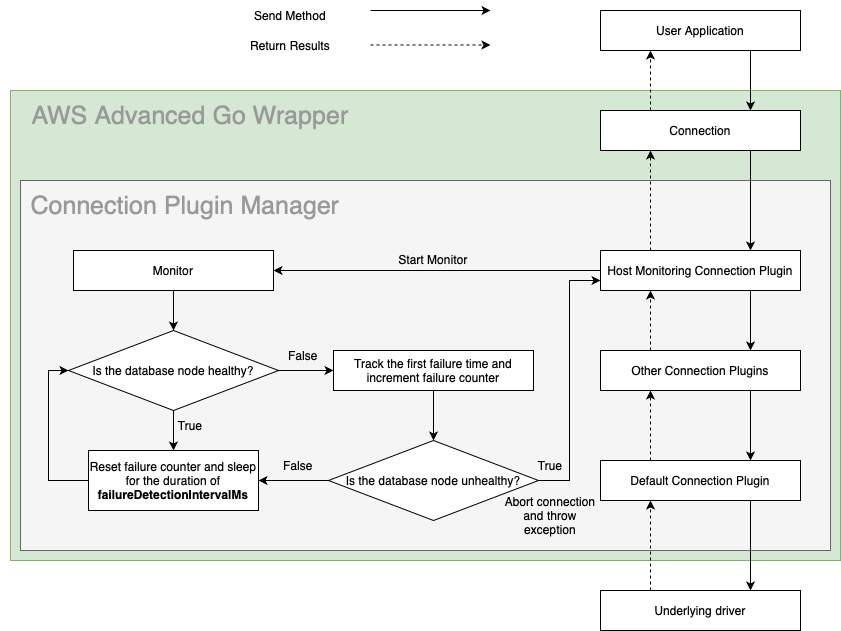
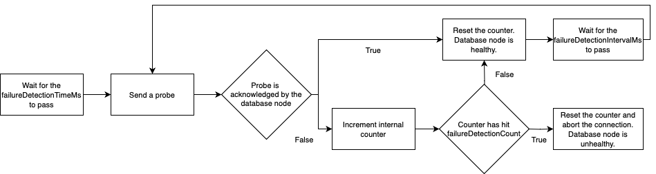

# Host Monitoring Plugin

## Enhanced Failure Monitoring

The following figure shows a simplified Enhanced Failure Monitoring (EFM) workflow. EFM is a feature available from the Host Monitoring Plugin. The Host Monitoring Plugin periodically checks the connected database instance's health or availability. If a database instance is determined to be unhealthy, the connection will be aborted. The Host Monitoring Plugin uses the [Enhanced Failure Monitoring Parameters](#enhanced-failure-monitoring-parameters) and a database instance's responsiveness to determine whether a instance is healthy.

<div style="text-align:center"></div>

### The Benefits of Enhanced Failure Monitoring
Enhanced Failure Monitoring helps user applications detect failures earlier. When a user application executes a query, EFM may detect that the connected database instance is unavailable. When this happens, the query is cancelled and the connection will be aborted. This allows queries to fail fast instead of waiting indefinitely or failing due to a timeout.

One use case is to pair EFM with the [Failover Plugin](./UsingTheFailoverPlugin.md). When EFM discovers a database instance failure, the connection will be aborted. Without the Failover Plugin, the connection would be terminated up to the user application level. With the Failover Plugin, the Go wrapper can attempt to failover to a different, healthy database instance where the query can be executed.

Not all applications will have a need for Enhanced Failure Monitoring. If an application's query times are predictable and short, and the application does not execute any long-running SQL queries, Enhanced Failure Monitoring may be replaced with one of the following alternatives that consumes fewer resources and is simpler to configure. 

The [alternatives](#enhanced-failure-monitoring-alternatives) are: 
1. configuring [client-side connection settings](#client-side-connection-settings), or
2. setting a [timeout value using the context package](#timeout-using-context)

Although these alternatives are available and easy to configure, EFM is more configurable than simple network timeouts. Users should keep these advantages and disadvantages in mind when deciding whether Enhanced Failure Monitoring is suitable for their application.

### Enhanced Failure Monitoring Alternatives

#### Client-Side Connection Settings
This option is useful when a user application executes quick statements that run for predictable lengths of time. In this case, the network timeout should be set to a value such as the 95th to 99th percentile. One way to do this is by setting timeout parameters in the DSN. The parameters and options will depend on the underlying driver.

#### Timeout Using Context
This option should be used in similar situations as client-side connection settings. 

```go
// Create a context with a timeout, this example sets a timeout of 5 seconds.
ctx, cancel := context.WithTimeout(context.Background(), 5*time.Second)
defer cancel() // Always call cancel to release resources.

// Execute query with timeout context.
var result string
err = db.QueryRowContext(ctx, "SELECT 1").Scan(&result)

if errors.Is(err, context.DeadlineExceeded) {
    // Query timed out.
}
```

### Enabling the Host Monitoring Plugin
Enhanced Failure Monitoring will be enabled by default if the [`plugins`](../UsingTheGoWrapper.md#connection-plugin-manager-parameters) value is not specified. The Host Monitoring Plugin can also be explicitly included by adding the plugin code `efm` to the `plugins` value. Because Enhanced Failure Monitoring is enabled by default, it can only be excluded by setting the parameter `plugins` to a string that does not include the `efm` code, such as `"failover"`, or `"failover,iam"`.

> [!NOTE]
> When loading the Host Monitoring Plugin, the order plugins are loaded in matters. If setting the [`autoSortPluginOrder`](../UsingTheGoWrapper.md#connection-plugin-manager-parameters) parameter to `false`, we recommend that you load the Host Monitoring Plugin at the end (or as close to the end) as possible. When used in conjunction with the Failover Plugin, the Host Monitoring Plugin must be loaded after the Failover Plugin. For example, when loading plugins with the `plugins` parameter, the parameter value should be `failover,...,efm`.
> 

### Enhanced Failure Monitoring Parameters
<div style="text-align:center"></div>

Each connection has its own set of the parameters `failureDetectionTimeMs`, `failureDetectionIntervalMs`, and `failureDetectionCount`. The `failureDetectionTimeMs` parameter determines how long the monitor waits after a SQL query is started to send a probe to a database instance. The `failureDetectionIntervalMs` is how often the monitor sends a probe to a database instance. The `failureDetectionCount` is how many times a monitor probe can go unacknowledged before the database instance is deemed unhealthy. 

To determine the health of a database instance: 
1. The monitor will first wait for a time equivalent to the `failureDetectionTimeMs`. 
2. Then, every `failureDetectionIntervalMs`, the monitor will send a probe to the database instance. 
3. If the probe is not acknowledged by the database instance, a counter is incremented. 
4. If the counter reaches the `failureDetectionCount`, the database instance will be deemed unhealthy and the connection will be aborted.

If a more aggressive approach to failure checking is necessary, all of these parameters can be reduced to reflect that. However, increased failure checking may also lead to an increase in false positives. For example, if the `failureDetectionIntervalMs` was shortened, the plugin may complete several connection checks that all fail. The database instance would then be considered unhealthy, but it may have been about to recover and the connection checks were completed before that could happen.

| Parameter                    |  Value  | Required | Description                                                                                                      | Default Value |
|------------------------------|:-------:|:--------:|:-----------------------------------------------------------------------------------------------------------------|---------------|
| `failureDetectionCount`      | Integer |    No    | Number of failed connection checks before considering a database instance as unhealthy.                          | `3`           |
| `failureDetectionIntervalMs` | Integer |    No    | Interval in milliseconds between probes to a database instance.                                                  | `5000`        |
| `failureDetectionTimeMs`     | Integer |    No    | Interval in milliseconds between sending a SQL query to the server and the first probe to the database instance. | `30000`       |
| `monitorDisposalTimeMs`      | Integer |    No    | Interval in milliseconds for a monitor to be considered inactive and to be disposed.                             | `600000`      |

The Host Monitoring Plugin may create new monitoring connections to check the database instance's availability. You can configure these connection with driver-specific configurations by adding the `monitoring-` prefix to the configuration parameters, like the following example:

```go
// Configure different timeout values for the non-monitoring and monitoring connections.
pgxDsn := "... connect_timeout=30 monitoring-connect_timeout=10"
```

> [!WARNING]
> Always ensure you provide non-zero timeout values to the Host Monitoring Plugin
>
> The Host Monitoring Plugin does not have default timeout values such as `connect_timeout` since these values are driver specific. Most Go drivers use 0 as the default timeout value. If you **do not** override the default timeout value, the Host Monitoring Plugin may wait forever to establish a monitoring connection in the event where the database instance is unavailable.

> [!WARNING] 
> #### Warnings About Usage of the AWS Advanced Go Wrapper with RDS Proxy
> We recommend you either disable the Host Monitoring Plugin or avoid using RDS Proxy endpoints when the Host Monitoring Plugin is active.
>
> Although using RDS Proxy endpoints with the AWS Advanced Go Wrapper with Enhanced Failure Monitoring doesn't cause any critical issues, we don't recommend this approach. The main reason is that RDS Proxy transparently re-routes requests to a single database instance. RDS Proxy decides which database instance is used based on many criteria (on a per-request basis). Switching between different instances makes the Host Monitoring Plugin useless in terms of instance health monitoring because the plugin will be unable to identify which instance it's connected to, and which one it's monitoring. This could result in false positive failure detections. At the same time, the plugin will still proactively monitor network connectivity to RDS Proxy endpoints and report outages back to a user application if they occur.
